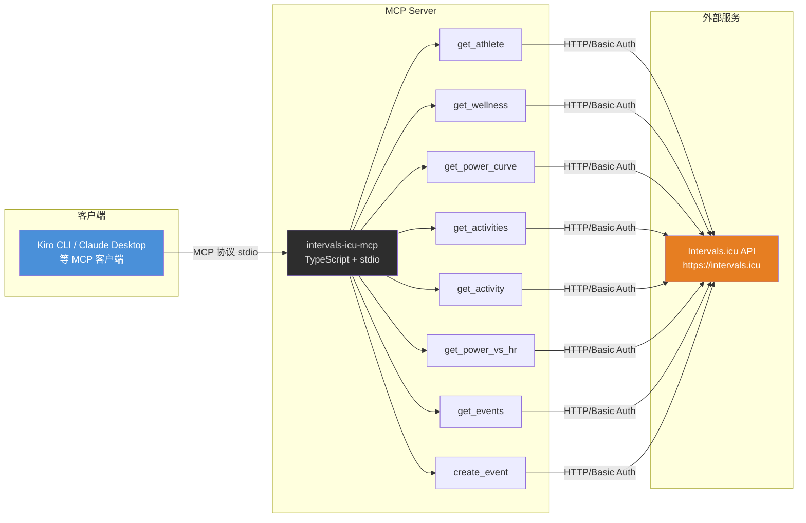
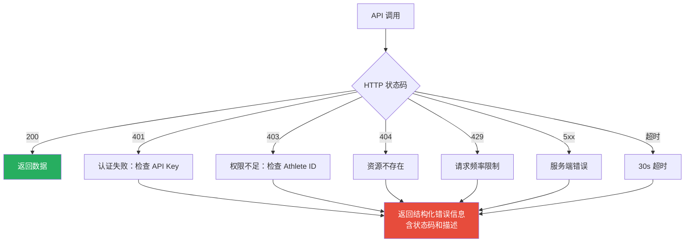
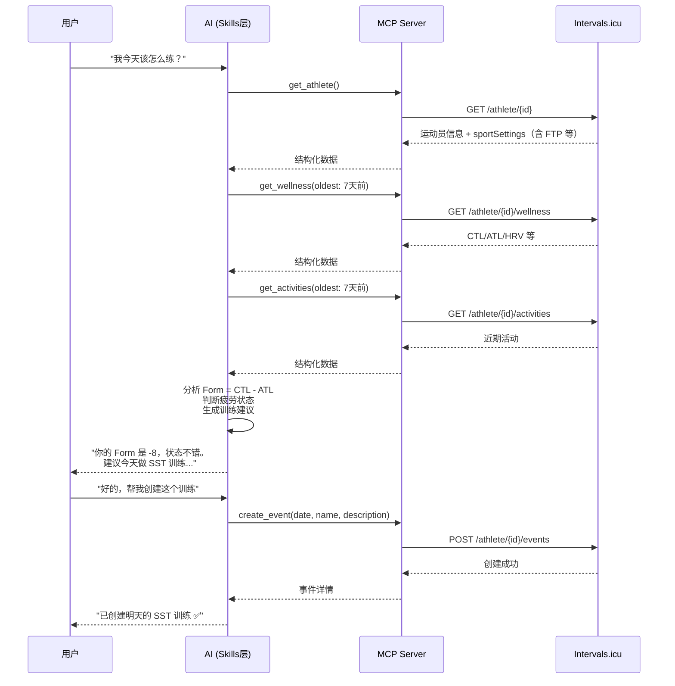

# 技术方案设计

## 1. 架构概览



## 2. 技术栈

| 组件 | 选型 | 说明 |
|------|------|------|
| 语言 | TypeScript 5.x | 类型安全 |
| 运行时 | Node.js 18+ | LTS |
| MCP SDK | `@modelcontextprotocol/sdk` | 官方 MCP TypeScript SDK |
| HTTP 客户端 | 内置 `fetch` | Node 18+ 原生支持，无需额外依赖 |
| 传输协议 | stdio | MCP 标准传输方式 |
| 构建 | `tsc` | 简单直接 |
| 包管理 | npm | 标准 |

## 3. 项目结构

```
icu/
├── package.json
├── tsconfig.json
├── .env.example              # 环境变量模板
├── src/
│   ├── index.ts              # 入口，注册 MCP Server 和所有工具
│   ├── client.ts             # Intervals.icu API 客户端（HTTP 封装）
│   ├── types.ts              # API 响应类型定义
│   └── tools/
│       ├── get-athlete.ts
│       ├── get-wellness.ts
│       ├── get-power-curve.ts
│       ├── get-activities.ts
│       ├── get-activity.ts
│       ├── get-power-vs-hr.ts
│       ├── get-events.ts
│       └── create-event.ts
└── .specs/                   # 需求文档（已有）
```

## 4. 核心模块设计

### 4.1 API 客户端（client.ts）

封装 Intervals.icu 的 HTTP 调用，统一处理认证和错误。

```typescript
// 核心设计
class IntervalsClient {
  private baseUrl = "https://intervals.icu";
  private athleteId: string;  // 从环境变量 INTERVALS_ATHLETE_ID
  private apiKey: string;     // 从环境变量 INTERVALS_API_KEY

  // 统一 GET 请求，自动带 Basic Auth
  // 路径中的 {ext} / {format} 参数统一传空字符串以获取 JSON
  async get<T>(path: string, params?: Record<string, string>): Promise<T>

  // 统一 POST 请求，自动带 Basic Auth
  async post<T>(path: string, body: unknown, params?: Record<string, string>): Promise<T>
}
```

认证方式：HTTP Basic Auth，`username = "API_KEY"`（字面量字符串），`password = apiKey`（实际的 key 值）。即 `Authorization: Basic base64("API_KEY:" + apiKey)`。

> **{ext} 路径参数处理约定**：wellness、power-curves、events、power-vs-hr 等端点的路径中 `{ext}` / `{format}` 是直接拼接在路径末尾的（如 `/wellness.csv`、`/power-curves.csv`），不是独立的路径段。获取 JSON 时不拼接任何扩展名，路径直接为 `/wellness`、`/power-curves`、`/events` 等。

### 4.2 MCP 工具定义

每个工具文件导出一个注册函数，包含：
- 工具名称和描述（英文，给 AI 看）
- 输入参数 schema（JSON Schema）
- 处理函数

### 4.3 工具参数与返回设计

#### get_athlete
- 参数：无
- 调用：`GET /api/v1/athlete/{id}`（返回 WithSportSettings，已含 sportSettings 数组）
- 处理：从 sportSettings 数组中过滤出 types 包含 `Ride` 的设置
- 返回：运动员基础信息 + 骑行运动设置（FTP、W'、Pmax、功率区间、心率区间）

#### get_wellness
- 参数：`oldest?`（默认 7 天前）、`newest?`（默认今天）
- 调用：`GET /api/v1/athlete/{id}/wellness`（路径 {ext} 传空字符串，返回 JSON）
- 返回：日期范围内的健康记录数组

#### get_power_curve
- 参数：`curves?`（默认 `"150d"`，支持如 `"42d,150d"` 多曲线对比）
- 调用：`GET /api/v1/athlete/{id}/power-curves`（路径 {ext} 传空字符串）
- 固定参数：`type=Ride`（API required）
- 返回：功率曲线数据（含功率模型 CP/W'/Pmax）

#### get_activities
- 参数：`oldest?`（默认 30 天前）、`newest?`（默认今天）
- 调用：`GET /api/v1/athlete/{id}/activities`
- 注意：`oldest` 在 API 层是 required，MCP 工具层需自行计算默认值传入
- 返回：活动列表（不做类型过滤，透传全部活动，让 AI 层自行判断——AI 教练可能需要看到交叉训练如跑步、力量来评估整体负荷）

#### get_activity
- 参数：`id`（必填）
- 调用：`GET /api/v1/activity/{id}?intervals=true`
- 返回：活动详情 + 间歇段数据 + 区间时间分布（含 decoupling、icu_efficiency_factor、icu_power_hr）

#### get_power_vs_hr
- 参数：`id`（必填）
- 调用：`GET /api/v1/activity/{id}/power-vs-hr`（路径 {ext} 传空字符串）
- 返回：详细的功率 vs 心率散点数据、分段分析、曲线拟合（补充 get_activity 中的概要数据）

#### get_events
- 参数：`oldest?`（默认今天）、`newest?`（默认 6 天后，含今天共 7 天，与 API 默认行为一致）
- 调用：`GET /api/v1/athlete/{id}/events`（路径 {format} 传空字符串，返回 JSON）
- 返回：日历事件列表

#### create_event
- 参数：`start_date_local`（必填）、`name`（必填）、`description`（必填，Intervals.icu 训练描述格式）、`type?`（默认 `"Ride"`）、`category?`（默认 `"WORKOUT"`）、`moving_time?`（可选，秒数）
- 调用：`POST /api/v1/athlete/{id}/events?upsertOnUid=false`
- 固定参数：`upsertOnUid=false`（创建新事件）
- 返回：创建的事件详情

## 5. 错误处理策略



所有错误统一在 `client.ts` 中捕获，转换为 MCP 的 `McpError` 返回给客户端。

## 6. 环境变量

| 变量名 | 必填 | 说明 |
|--------|------|------|
| `INTERVALS_API_KEY` | 是 | Intervals.icu API Key，在 Settings 页面获取 |
| `INTERVALS_ATHLETE_ID` | 是 | 运动员 ID，如 `i12345` |

## 7. MCP 客户端配置示例

```json
{
  "mcpServers": {
    "intervals-icu": {
      "command": "node",
      "args": ["dist/index.js"],
      "cwd": "/Users/Yuai/code/icu",
      "env": {
        "INTERVALS_API_KEY": "your-api-key",
        "INTERVALS_ATHLETE_ID": "iXXXXX"
      }
    }
  }
}
```

## 8. 数据流示例

以"AI 教练评估当前状态并给出建议"为例：


